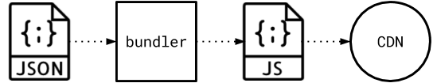
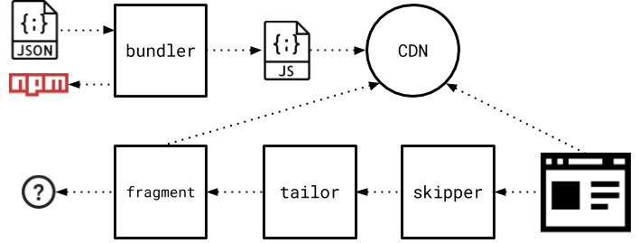

# Architecture

Tessellate consists of two major components: the bundler and the fragment. Together they make it possible to dynamically render HTML based on an abstract JSON definition. This section gives an overview of the two components and how they integrate with the Mosaic project.

## tessellate-bundler

The job of the **bundler** is to prepare JavaScript bundles that the fragment can render to static HTML. Bundles are UMD (universal module definition) modules which export the root component of a React component tree.

The compiled bundles are exported to a configurable location, e.g. a CDN server. A bundle may consist of multiple JavaScript files and additional assets, like CSS and images.

## tessellate-fragment

The **fragment** is responsible for rendering the prepared JavaScript bundles into static HTML using React's server side rendering capabilities. Upon receiving a request, the fragment determines which bundle it needs to fetch and render. Then it responds with static HTML and links to the JavaScript and CSS files of the bundle inside a response header, as defined by the Fragment API.

In addition to the JavaScript bundle a fragment may fetch more data from other sources that can be injected into the rendering process, e.g. properties for the React components or data that React components load themselves upon rendering based on their internal logic.

## Mosaic integration

Mosaic is an architecture to enable microservices in the frontend. That is, modular websites composed of smaller, independent parts – Fragments. Tessellate provides a generic solution for *dynamic Fragments* which can render any content based on an abstract JSON definition. A typical setup includes the following components:

* Tessellate bundler – compiles JavaScript bundles from JSON.
* Tessellate fragment – renders bundles into static HTML.
* Tailor layout service – composes multiple fragments Together.
* Skipper router – routes requests to different layouts.

Please take a look at the [Mosaic documentation](https://www.mosaic9.org) for more details.

Mosaic does not dictate which frontend technologies to use, however Tessellate requires that the rendered HTML is based on **React components**. For this reason tessellate-bundler must be able to require the necessary npm modules for the components that are declared inside the abstract JSON definition. The compiled bundles are placed in a public location (e.g. a CDN server) where they can be retrieved from by both the fragment and the browser (for dynamic components). The fragment may also access other additional web services based on the context of each request. For example, the property data to hydrate the React components may be loaded from another service.

Because of its modularity, Mosaic allows composing many different Fragments, not only Tessellate. Although a single Tessellate Fragment could in theory render a complete page, it is more common compose pages of more than one Fragment inside a Tailor layout. See the [Tailor documentation](https://github.com/zalando/tailor/blob/master/README.md) for more details.

Next, read more about [tessellate-bundler](Bundler.md) and [tessellate-fragment](Fragment.md)!
